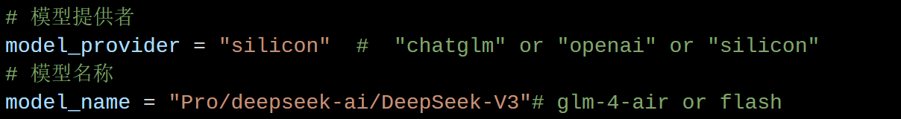
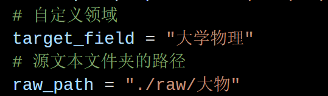
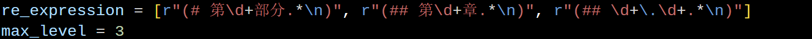
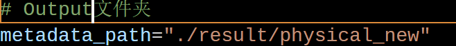

# This File Explains How to Use the Repository

## Get Started

### Python Environment

* Python version: 3.11
* The `requirements.txt` file contains the required packages (there may be some omissions).

### Environment Variables

**Temporary setup:**

* Windows PowerShell:

```bash
set SILICON_API_KEY=your_silicon_api_key_here
```

* Linux:

```bash
export SILICON_API_KEY=your_silicon_api_key_here
```

**Permanent setup:**

* Add the export statement to `.bashrc` on Linux.
* Add the environment variable `SILICON_API_KEY` to your user environment variables on Windows via system settings.

**Optional:**

* If you want to use OpenAI's API key, similarly add the `openai_api_key` environment variable.
* If you want to use ChatGLM's API key, add the `chatglm_api_key` environment variable.

### Preparing Configuration Files

* Configuration files are located in `src/config.py` and the folder `src/config_file/`.

* `src/config.py` contains general settings.

* `src/config_file/` contains specific settings.

**Modification process:**

1. Write specific configuration files according to different subjects. For example, for University Physics:

   * Create a new file `config_physics.py` under `src/config_file/`, copy all content from `config_default.py` as an initial template.
   * Modify fields:

     * To change the model or API used:
       
     * To change the subject, update the domain name and source file folder path:
       
     * Write regex expressions and levels according to the source file's structure:
       
     * Specify output folders including graph structure, cache, engine, etc.:
       

2. In the first two lines of `src/config.py`, re-import the specific configuration file you want to use, e.g.:

```python
from src.config_file.config_physics import *  # If your specific config file is config_physics.py
```

### Running the Program

The main entry point is `./main.py`, which includes:

```python
if __name__ == '__main__':
    freeze_support()
    os.environ["textbook"] = "psychology"
    from src.utils.process_manager import ProcessManager
    manager = ProcessManager(state_path = './state.json')
    manager.execute()
```

* `freeze_support()` is needed because multi-threaded API calls are used; it must be in the main process to avoid errors.
* To stop execution, close the VSCode terminal directly because Ctrl-C may not kill all threads cleanly.
* `ProcessManager` is a class managing the workflow with progress bars and ease of customization.
* For the more flexible usage of processmanager,see below later.

To run the program, simply use:

```shell
python main.py
```

## ProcessManager Workflow Task Documentation

## 1. General Format

- **Simple tasks**: specified as strings, e.g., `"doc2section"`.
- **Parameterized tasks**: specified as dictionaries, containing a `"name"` field and additional parameters.

## 2. Task List Description

### 2.1. Simple String Tasks

| Task Name              | Description                        | Module Path                                          | Notes                                                 |
| ---------------------- | -------------------------------- | ---------------------------------------------------- | ----------------------------------------------------- |
| `"doc2section"`        | Convert documents into sections   | `src.workflow.initial_skeleton.documents_to_section` | No parameters                                         |
| `"community_report"`   | Generate community report         | `src.workflow.initial_skeleton.community_report`     | No parameters                                         |
| `"section2tree"`       | Convert sections to tree structure| `src.workflow.initial_skeleton.entity_extraction`    | No parameters                                         |
| `"augmentent"`         | Entity augmentation generation    | `src.workflow.augmentation.augmented_generation`     | Parameters depend on whether this task has run before |
| `"augmentrel"`         | Relation augmentation generation  | Same as above                                        | Depends on whether `"augmentent"` has been run before |
| `"aggregation-naive"`  | Naive local role aggregation      | `src.workflow.augmentation.transportation`           | Called with `need_ask=False`                           |
| `"aggregation-llm"`    | LLM-based local role aggregation  | Same as above                                        | Called with `need_ask=True`                            |
| `"identical_predict"`  | Predict entity identicality       | `src.workflow.augmentation.relation_predict`         | Parameters detailed in code                           |
| `"connection_predict"` | Predict entity connections        | Same as above                                        | Parameters detailed in code                           |
| `"continue_iteration"` | Continue prediction iterations    | Same as above                                        | No parameters                                         |
| `"visualization_internal"` | Visualize tree structures      | `src.workflow.visualization.tree_visualize`          | Async task                                            |

### 2.2. Parameterized Dictionary Tasks

Example dictionary task format:

```json
{
  "name": "task_name",
  "param1": "value1",
  "param2": "value2",
  ...
}
```

| Task Name                  | Parameters and Format                                                                  | Module Path                                                       | Notes                            |
| -------------------------- | -------------------------------------------------------------------------------------- | ----------------------------------------------------------------- | -------------------------------- |
| `"internal2uniform"`       | `"data_root"`: data root path (optional)                                               | `src.eval.prepare_for_eval.internal2uniform`                      | Defaults to `metadata_path`      |
| `"eval_ES"`                | `"target_field"`: target field (optional)<br>`"data_root"`: data path (optional)       | `src.eval.eval_entity.ES_external`                                | Defaults to `metadata_path/eval` |
| `"eval_RS"`                | `"data_root"`: data path (optional)                                                    | `src.eval.eval_relation.RS_external`                              | Defaults to `metadata_path/eval` |
| `"eval_ER"`                | `"gt_root"`: ground truth path (required)<br>`"pred_root"`: prediction path (required) | `src.eval.eval_entity.ER_CROSS`                                   | Entity cross evaluation          |
| `"external2uniform"`       | `"data_root"`: data root path (required)                                               | `src.eval.prepare_for_eval.external2uniform`                      | Data format unification          |
| `"MEC&MED"`                | `"gt_root"`: ground truth path (required)<br>`"pred_root"`: prediction path (required) | `src.eval.eval_mapping.MEC_MED`                                   | Mapping evaluation metrics       |
| `"visualization_external"` | `"data_root"`: data root path (optional)                                               | `src.workflow.visualization.visual_others.visualize_native_graph` | Async visualization task         |

## 3. Usage Examples

### 3.1. Default Workflow Execution

```python
pm = ProcessManager.get_default_manager()
pm.execute()
```

This will execute the following default workflow in order:

```python
[
  "doc2section",
  "community_report",
  "section2tree",
  "augmentent",
  "augmentrel",
  "aggregation-naive",
  "identical_predict",
  "connection_predict",
  "continue_iteration",
]
```

You can also customize your own workflow list.

---

### 3.2. Parameterized (Validation) Tasks

#### 3.2.1. Entity Recall Evaluation

Prepare two entity sets in evaluation mode. For example, suppose you have a knowledge graph built by tree-KG method with the following directory structure:

* `dataroot1`

  * `cache`
  * `graph`
  * `engine`
  * `eval` (generated after `internal2uniform`)

Workflow to convert internal data to uniform format:

```python
workflow = [
    {"name": "internal2uniform", "data_root": "path_to_dataroot"},
]
```

To prepare external data for cross-validation or ground truth comparison, external data must provide at least `relations.json` and `nodes.json` in `dataroot2`:

* `nodes.json` format:

```json
[
  {
    "title": "entity name",
    "id": 0,
    "description": "entity description, empty string if none"
  }
]
```

* `relations.json` format:

```json
[
  {
    "source_id": 0,
    "target_id": 1,
    "description": "relation description, empty string if none"
  }
]
```

Convert external data to uniform format:

```python
workflow = [
  {"name": "external2uniform", "data_root": "path_to_dataroot"}
]
```

Then perform evaluation:

```python
workflow = [
  {"name": "eval_ER", "pred_root": "path_to_pred_dataroot(dataroot1/eval)", "gt_root": "path_to_gt_dataroot(dataroot2)"}
]
```

Complete example code:

```python
from src.utils.process_manager import ProcessManager
task_list = [
      {"name": "internal2uniform",  "data_root": "path_to_dataroot"},
      {"name": "external2uniform", "data_root": "path_to_dataroot"},
      {"name": "eval_ER", "pred_root": "path_to_pred_dataroot(dataroot1/eval)", "gt_root": "path_to_gt_dataroot(dataroot2)"}
]
pm = ProcessManager(task_list, state_path='./state.json', from_scratch=True)
pm.execute()
```

The results will be saved to `dataroot1/eval/result.json`.

---

#### 3.2.2. Entity Strength Evaluation

Prepare internal/external data and then run:

```python
from src.utils.process_manager import ProcessManager
task_list = [
      {"name": "eval_ES", "data_root": "path_to_dataroot(contains nodes.json)", "target_field": "target_domain"},
]
pm = ProcessManager(task_list, state_path='./state.json', from_scratch=True)
pm.execute()
```

---

#### 3.2.3. Relation Strength Evaluation

Prepare internal/external data and then run:

```python
from src.utils.process_manager import ProcessManager
task_list = [
      {"name": "eval_RS", "data_root": "path_to_dataroot(contains relations.json)"}
]
pm = ProcessManager(task_list, state_path='./state.json', from_scratch=True)
pm.execute()
```

---

#### 3.2.4. MEC & MED Evaluation

Prepare internal/external data and then run:

```python
from src.utils.process_manager import ProcessManager
task_list = [
      {"name": "MEC&MED", "pred_root": "path_to_pred_dataroot(dataroot1/eval)", "gt_root": "path_to_gt_dataroot(dataroot2)"}
]
pm = ProcessManager(task_list, state_path='./state.json', from_scratch=True)
pm.execute()
```
