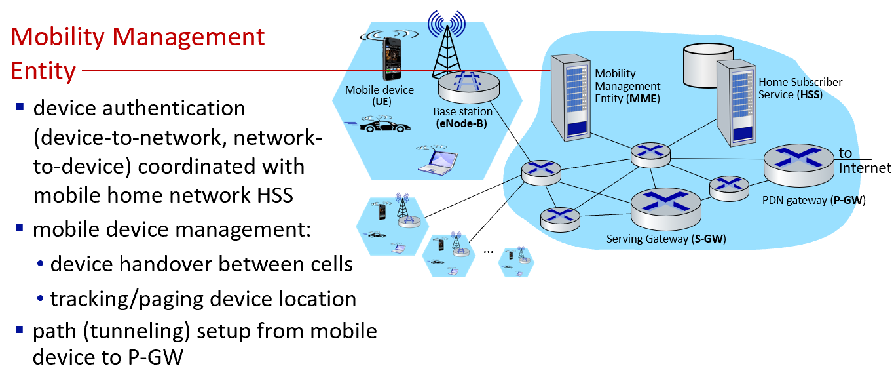

## Elements of 4G LTE architecture

* device handover between cells

📚 知识卡片: Device Handover

**解释**: 设备在蜂窝网络中从一个小区切换到另一个小区的过程，以保持通信连续性。

**示例**: 当你在移动中打电话时，手机会自动从当前基站切换到信号更强的新基站。

**有趣事实**: 设备切换过程中，通话或数据连接通常不会中断，用户体验无缝切换。

* tracking/paging device location

📚 知识卡片: Tracking/Paging

**解释**: 跟踪和寻呼设备位置的过程，以便在需要时建立连接。

**示例**: 当你收到短信时，网络会通过寻呼消息找到你的设备并建立连接。

**有趣事实**: 跟踪和寻呼机制确保即使在设备空闲时，网络也能快速找到并连接设备。

* ■ path (tunneling) setup from mobile device to P-GW

📚 知识卡片: Path (Tunneling) Setup

**解释**: 从移动设备到P-GW（分组数据网关）的路径设置，通常通过隧道技术实现。

**示例**: 当你使用手机上网时，数据会通过一条虚拟隧道从手机传输到P-GW。

**有趣事实**: 隧道技术可以确保数据在传输过程中的安全性和完整性。

📚 知识扩展

4G LTE架构中的关键组件包括eNodeB（演进型Node B）、MME（移动管理实体）、SGW（服务网关）和P-GW（分组数据网关）。eNodeB负责无线通信，MME处理信令和移动性管理，SGW和P-GW则负责数据路由和转发。设备切换、跟踪和寻呼以及路径设置是LTE网络中的核心功能，确保用户在不同小区之间移动时仍能保持高质量的通信体验。

🎓 易化学习

想象一下，4G LTE网络就像一条高速公路，eNodeB是路边的信号塔，MME是交通指挥中心，SGW和P-GW是收费站。当你开车（使用手机）在高速公路上行驶时，信号塔会不断跟踪你的位置，并在你接近下一个收费站时，自动将你引导到正确的路线上，确保你始终在最快的车道上行驶。这就是设备切换、跟踪和寻呼以及路径设置的基本原理。

