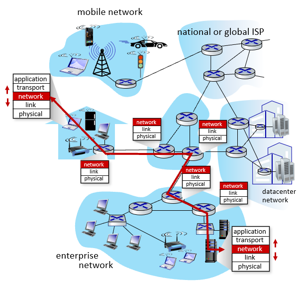

## Network-layer services and protocols

##### ■ transport segment from sending to receiving host

*  *sender: encapsulates segments into* datagrams,passes to link layer
*  receiver: delivers segments to transport layer protocol

##### ■ network layer protocols in every Internet device: hosts, routers

##### ■ routers:

*  examines header fields in all IP datagrams passing through it
*  moves datagrams from input ports to output ports to transfer datagrams along end-end path

