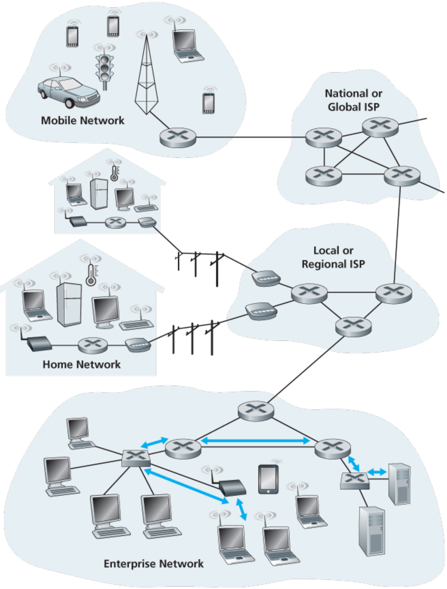

### 6.1 Introduction to the Link Layer

Let's begin with some important terminology.We'll find it convenient in this chapter to refer to any device that runs a link-layer (i.e., layer 2) protocol as a  **node** . Nodes include hosts, routers, switches, and WiFi access points (discussed in  **Chapter 7** ). We will also refer to the communication channels that connect adjacent nodes along the communication path as  **links** . In order for a datagram to be transferred from source host to destination host, it must be moved over each of the  *individual links*  in the end-to-end path. As an example, in the company network shown at the bottom of  **Figure 6.1** , consider sending a datagram from one of the wireless hosts to one of the servers. This datagram will actually pass through six links: a WiFi link between sending host and WiFi access point, an Ethernet link between the access point and a link-layer switch; a link between the link-layer switch and the router, a link between the two routers; an Ethernet link between the router and a link-layer switch; and finally an Ethernet link between the switch and the server. Over a given link, a transmitting node encapsulates the datagram in a  **link-layer frame**  and transmits the frame into the link.

In order to gain further insight into the link layer and how it relates to the network layer, let's consider a transportation analogy. Consider a travel agent who is planning a trip for a tourist traveling from Princeton, New Jersey, to Lausanne, Switzerland. The travel agent decides that it is most convenient for the tourist to take a limousine from Princeton to JFK airport, then a plane from JFK airport to Geneva's airport, and finally a train from Geneva's airport to Lausanne's train station. Once the travel agent makes the three reservations, it is the responsibility of the Princeton limousine company to get the tourist from Princeton to JFK; it is the responsibility of the airline company to get the tourist from JFK to Geneva; and it is the responsibility

of the Swiss train service to get the tourist from Geneva to Lausanne. Each of the three segments of the trip is "direct" between two "adjacent" locations. Note that the three transportation segments are managed by different companies and use entirely different transportation modes (limousine, plane, and train). Although the transportation modes are different, they each provide the basic service of moving passengers from one location to an adjacent location. In this transportation analogy, the tourist is a datagram, each transportation segment is a link, the transportation mode is a link-layer protocol, and the

